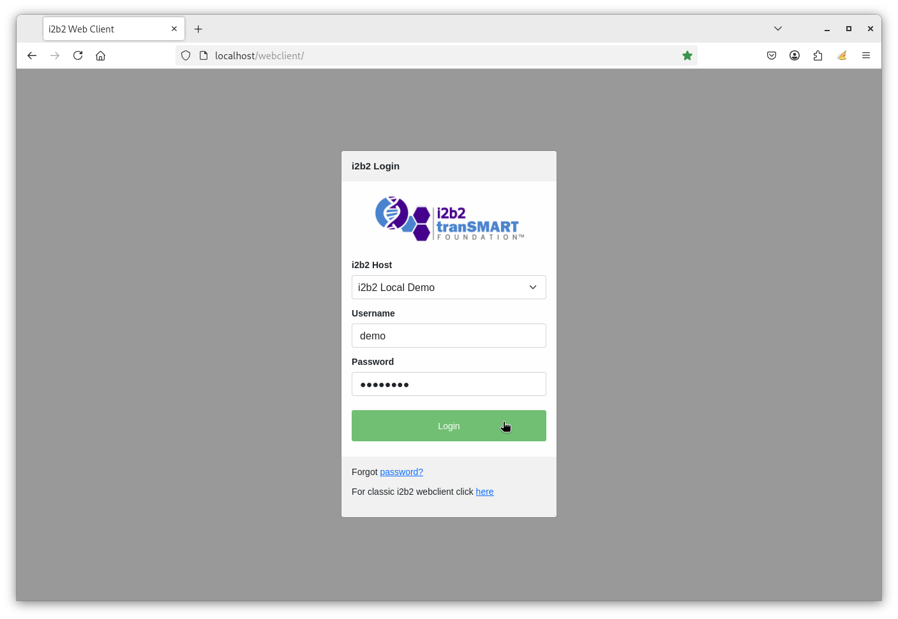
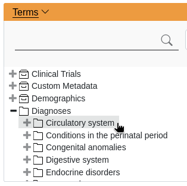
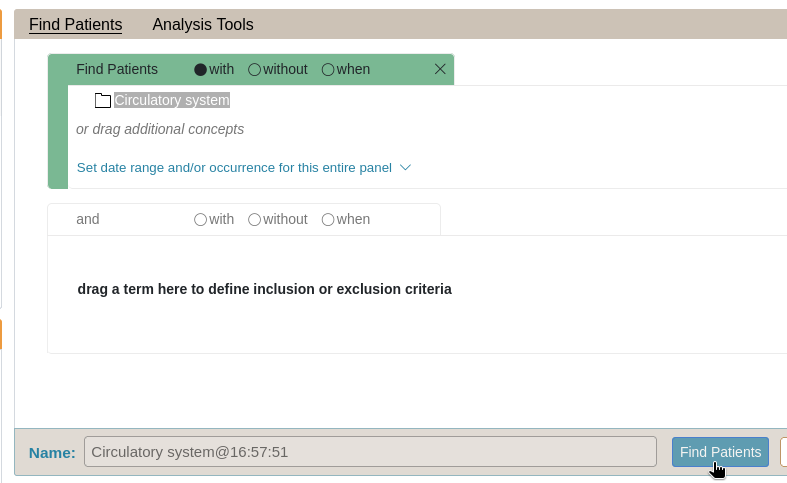
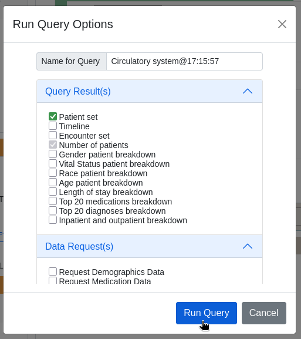
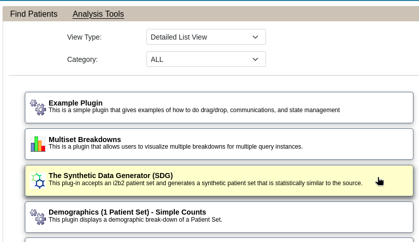

# synth-data
This an i2b2 plug-in that accepts an i2b2 patient set and generates a synthetic patient set that is statistically similar to the source.

## Installing the Software

- [Quick installation guide](docs/QUICK_INSTALL_plugin.md).

## Docker Demo

We provide Docker images of the following services for testing purposes:

- i2b2 Webclient with the synthdata plugin installed (i2b2-webclient-demo).
- i2b2 core servers (i2b2-core-server-demo).
- i2b2 demo database (i2b2-data-demo).
- synthdata REST services (synth-worker).
- syntdata task queue (celery-worker).
- Redis server (synth-redis)

### Running the Docker Demo

Open up a terminal in the directory **synth-data/docker** and type the following to run the Docker demo:

```
docker compose up -d
```

Open up a web browser and go to the URL [http://localhost/webclient/](http://localhost/webclient/).

### Stopping the Docker Demo

To stop the Docker containers, type the following:

```
docker compose down -v
```

> It is important to use -v flag remove all volumes.  If the -v flag is omitted, only the containers and networks will be removed, and the volumes will persist.

### Generate Synthic Dataset

We will use the synthdata plugin to generate synthetic dataset closely resembling the data in the i2b2 database.

Go to [http://localhost/webclient/](http://localhost/webclient/) and log into the i2b2 webclient:



#### Creating a Paitent Set

We first need to create a patient set.  Let's create a patient set with the term "Circulatory system".

1. Select the term ***Circulatory system***, underneath the term ***Diagnoses***

    

2. Drag the term over to the right panel and click on the button "Find Patients".
    

3. Check the checkbox ***Patient set*** and click the ***Run Query*** button:
    

#### Creating a Synthetic Dataset

1. Click on the ***Analysis Tools*** link and select the sythdata plugin by clicking on the ***The Synthetic Data Generate***.

